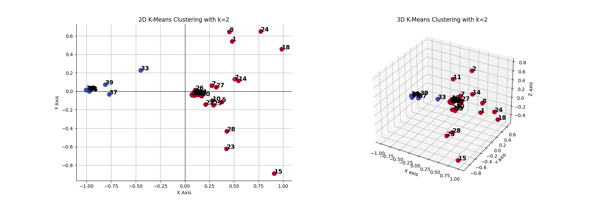

# ViraSeqAnalytics

  
*Image above: AI-generated banner representing RNA sequencing, virus variant detection, and data analysis.*

## Overview
This project focuses on the identification of coronavirus variants through advanced genomic analysis. It is a part of my academic work, specifically a TIPE (a French academic initiative for hands-on, research-oriented projects), emphasizing personal initiative and research. The aim is to utilize shotgun sequencing, the Burrows-Wheeler Transform (BWT), FM-index, and principal component analysis to analyze and interpret genomic data related to COVID-19.

## Objective
The main goal is to identify specific variants by comparing the genome to a reference sequence. We first reconstruct the full coronavirus genome, which is fragmented into several tiny `reads`. Then, we combine BWT and FM-index for data extraction and principal component analysis for in-depth genomic analysis.

## Methodology
1. **Shotgun Sequencing**: Employing shotgun sequencing for fast and efficient reading of coronavirus genome fragments.
2. **Genome Reconstruction**: Using complex algorithms and optimization to reconstruct the full genome.
3. **Data Extraction**: Using BWT and FM-index for comparing fragmented genomic data with reference genomes.
4. **Data Analysis**: Implementing principal component analysis to deeply analyze the genomic data.
5. **Variant Identification**: Using clustering algorithms to classify different variants.

## Tools and Technologies
- **Shotgun Sequencing (Modelisation)**
- **BWT & FM-index**
- **Principal Component Analysis**
- **K-means Clustering**
- **Programming Language**: Python

## Data Source
- Genomic data for this project was sourced from the [NCBI website](https://www.ncbi.nlm.nih.gov/labs/virus/vssi/#/virus?SeqType_s=Nucleotide&VirusLineage_ss=Severe%20acute%20respiratory%20syndrome%20coronavirus%202,%20taxid:2697049).

## Current Status and Future Enhancements
- Initial studies have successfully identified two geographic variants of the coronavirus collected in the same period.


*We can observe the separation between the two groups: the first comprising 30 British viruses, and the second consisting of 10 Swiss viruses.*

- Future plans involve expanding our data collection by reading FASTA files and saving them into a database, and then loading elements from the database into Python.

## Installation and Usage

### Installation

1. Clone the repository:
   ```bash
   git clone https://github.com/IFaTaK/ViraSeqAnalytics.git
   ```

2. Navigate to the project directory:
   ```bash
   cd ViraSeqAnalytics
   ```

3. **Create a virtual environment:**
   ```bash
   python -m venv venv
   ```

4. **Activate the virtual environment:**
   - On Windows:
     ```bash
     .\venv\Scripts\activate
     ```
   - On macOS and Linux:
     ```bash
     source venv/bin/activate
     ```

5. **Install the required modules:**
   ```bash
   pip install -r requirements.txt
   ```

### Usage

To use the ViraSeqAnalytics project, you can run the main script or import and use individual modules as per your needs. Here are some basic steps to get started:

1. **Running the Main Script:**
   - If there is a main script provided, execute it using:
     ```bash
     python main.py
     ```

2. **Data Analysis and Visualization:**
   - The project includes modules for data analysis and visualization. Explore these modules for various bioinformatics analysis tasks.

For more detailed documentation and usage examples, please refer to the project's [GitHub repository](https://github.com/IFaTaK/ViraSeqAnalytics).

## Acknowledgements
This project was initiated as a collaborative effort between [Kilian LEFEVRE](https://github.com/IFaTaK), Anthony CANNIAUX, and Baptiste ORTILLION. Kilian LEFEVRE is currently leading further development and enhancements.

## License
This project is licensed under the GNU General Public License.

## Contributing

Contributions are welcome! Please fork the repository and submit a pull request with your proposed changes. Adhere to the existing code style and include tests for new features.

## Contact

For any inquiries or further information about this project, please use the [Issues section of this GitHub repository](https://github.com/IFaTaK/RNA_Sequencing/issues). This is the preferred channel for questions, suggestions, or discussions regarding the project.

For more about my work and contributions, you can visit [my GitHub profile](https://github.com/IFaTaK).

```
ViraSeqAnalytics
├─ assets
│  ├─ Initial_studie.png
│  └─ project-banner.png
├─ src
│  ├─ __init__.py
│  ├─ align_genome.py
│  ├─ bwt.py
│  ├─ cluster_detection.py
│  ├─ extraction.py
│  ├─ fmindex.py
│  ├─ genome.py
│  └─ pca.py
├─ tests
│  ├─ __init__.py
│  ├─ align_genome_test.py
│  ├─ bwt_test.py
│  ├─ cluster_detection_test.py
│  ├─ extraction_test.py
│  ├─ fmindex_test.py
│  └─ pca_test.py
├─ LICENSE
├─ README.md
├─ __init__.py
├─ main.py
├─ requirements.txt
└─ setup.py
```